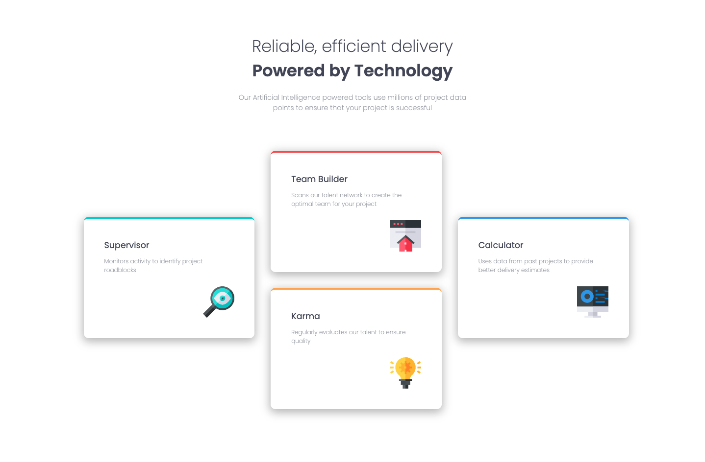
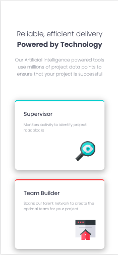

# Frontend Mentor - Four card feature section solution

This is a solution to the [Four card feature section challenge on Frontend Mentor](https://www.frontendmentor.io/challenges/four-card-feature-section-weK1eFYK). Frontend Mentor challenges help you improve your coding skills by building realistic projects. 

## Table of contents

- [Overview](#overview)
  - [The challenge](#the-challenge)
  - [Screenshot](#screenshot)
  - [Links](#links)
- [My process](#my-process)
  - [Built with](#built-with)
  - [What I learned](#what-i-learned)
  - [Continued development](#continued-development)
  - [Useful resources](#useful-resources)
- [Author](#author)

## Overview

### The challenge

Users should be able to:

- View the optimal layout for the site depending on their device's screen size

### Screenshot





### Links

- Solution URL: [Portfolio](https://gelatodigital.com/portfolio)
- Live Site URL: [Add live site URL here](https://your-live-site-url.com)

## My process

### Built with

- Semantic HTML5 markup
- CSS custom properties
- Flexbox
- CSS Grid
- Mobile-first workflow

### What I learned

This challenge was my real introduction to css grid.

I used on the different color cards:
```css
.card {
    display: grid;
    grid-template-rows: 15% 30% auto;
    border-radius: 10px;
    box-shadow: 0px 5px 18px 2px rgba(0,0,0,0.26);
    margin-bottom: 10%;
    padding: 10%;
    height: 20vh;
}
```
And also on the desktop display:
```css
.mid{
    margin-top: 7%;
    display: grid;
    grid-template-columns: 31.8% 3% 31.8% 3% 31.8%;
    grid-template-rows: 135px 145px 135px;
    grid-template-areas: 
    ". . vermelho . ."
    "verde . . . azul"
    ". . amarelo . .";
}
```

### Continued development

This challenge went extremelly quick. In on epart thanks to may daily trainning, but mostly it was due to the power of CSS Grid. From now on I'm dropping the wrapper classes, and abusing grid's power as much as possible

### Useful resources

- [css grid guide](https://css-tricks.com/snippets/css/complete-guide-grid/) - All you need to know to get started with grid. it is actually smaller than it looks at first glance. Also, it is a super fast read

## Author

- Website - [Rodrigo Barbosa](https://gelatodigital.com)
- Frontend Mentor - [@Rod-Barbosa](https://www.frontendmentor.io/profile/Rod-Barbosa)
